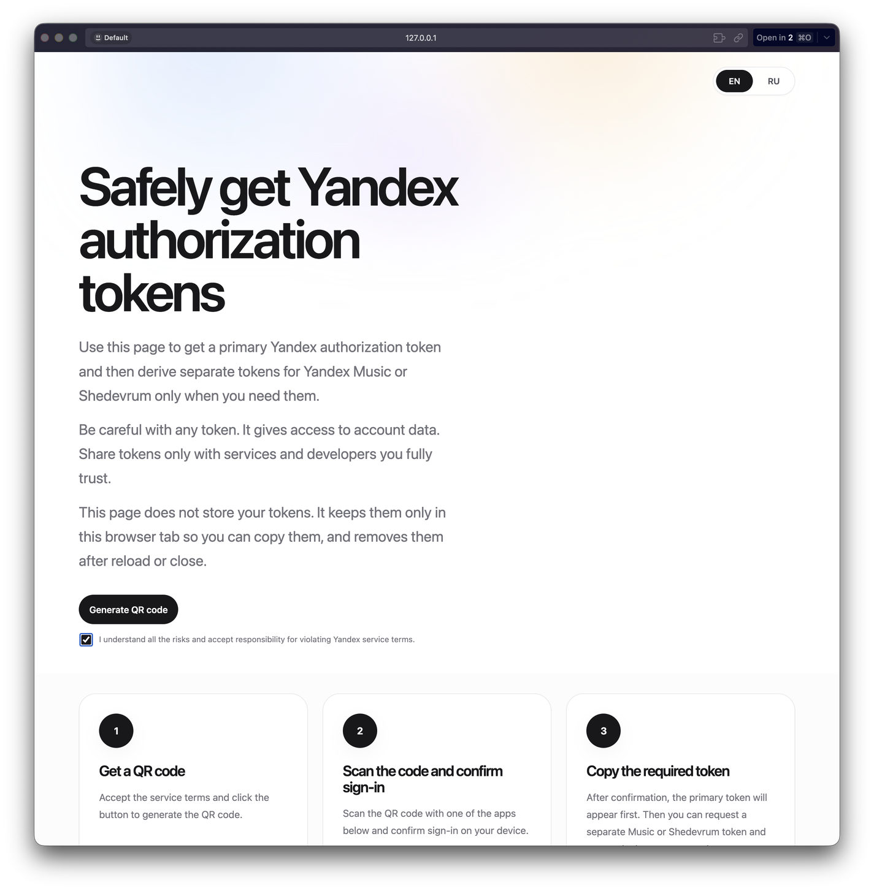
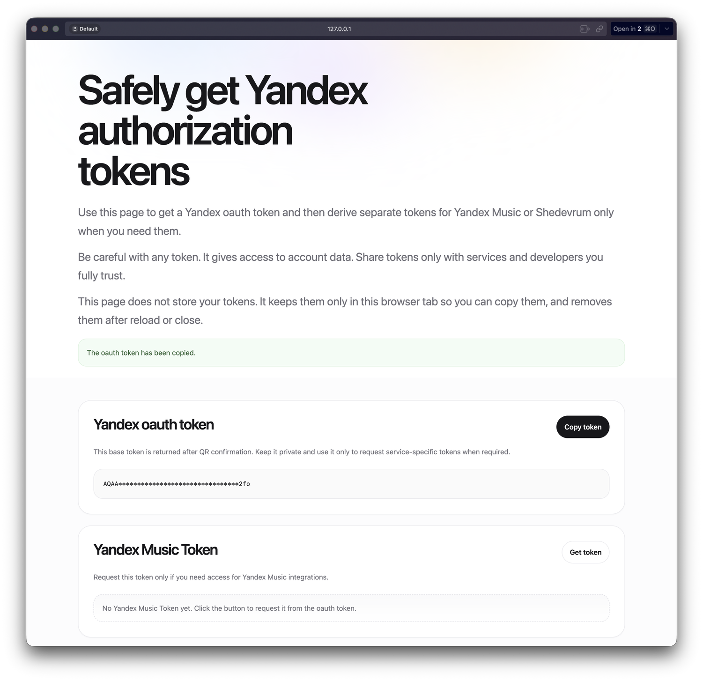

# yandex-auth-token

A local service for obtaining a base Yandex OAuth token through QR authorization and exchanging it into separate tokens for Yandex Music or Shedevrum when needed.

Inspired by [`yandex_session.py`](https://github.com/AlexxIT/YandexStation/blob/master/custom_components/yandex_station/core/yandex_session.py) from the [`AlexxIT/YandexStation`](https://github.com/AlexxIT/YandexStation) project.




[](https://developer.mozilla.org/en-US/docs/Web/JavaScript) [](#technology) [](#standalone-build) [](#features) [](#license)

> [!WARNING]
> This application works with sensitive access tokens. Run it only in a trusted environment and never share generated tokens unless you fully understand the consequences.

## Table of Contents

- [Features](#features)
- [Technology](#technology)
- [Quick Start](#quick-start)
- [Environment Variables](#environment-variables)
- [Authorization Flow](#authorization-flow)
- [API](#api)
- [Standalone Build](#standalone-build)
- [Project Structure](#project-structure)
- [Security](#security)
- [License](#license)
- [Disclaimer](#disclaimer)

## Features

- creates a Yandex QR sign-in session
- returns the base Yandex OAuth token after sign-in confirmation
- exchanges the base token into a Yandex Music token on demand
- exchanges the base token into a Shedevrum token on demand

## Technology

| Layer | Implementation |
| --- | --- |
| Backend | JavaScript, ESM modules, native `fetch`, local HTTP server |
| Frontend | HTML, CSS, Vanilla JavaScript |
| Security | Basic Auth / Bearer Auth, IP allowlist, rate limiting, replay protection |
| Build | `bun build --compile`, `codesign`, `Makefile` |

## Quick Start

### Requirements

- [Bun](https://bun.sh/) 1.x
- credentials and identifiers for Passport, Music, and Shedevrum token exchange
- macOS if you want a signed standalone binary

### Local Run

```bash
cp .env.example .env
```

Fill in the required secrets and identifiers in `.env`, then start the app:

```bash
bun run dev
```

By default, the service starts at [http://127.0.0.1:3101](http://127.0.0.1:3101).

### Available Commands

```bash
bun run dev
bun run start
bun run check
bun test
```

## Environment Variables

The following values are required for a working token exchange flow:

- `TOKEN_BY_SESSION_CLIENT_ID`
- `TOKEN_BY_SESSION_CLIENT_SECRET`
- `MUSIC_CLIENT_ID`
- `MUSIC_CLIENT_SECRET`
- `MUSIC_APP_ID`
- `MUSIC_DEVICE_ID`
- `SHEDEVRUM_CLIENT_ID`
- `SHEDEVRUM_CLIENT_SECRET`
- `SHEDEVRUM_APP_ID`
- `SHEDEVRUM_APP_VERSION`
- `SHEDEVRUM_UUID`
- `SHEDEVRUM_DEVICE_ID`

All other variables already have defaults and are used to tune server behavior, logging, security, and device metadata.

<details>
  <summary><strong>Full environment variable list</strong></summary>

### Server

- `PORT` - HTTP service port
- `HOST` - bind address
- `YANDEX_AUTH_SESSION_TTL_MS` - QR session TTL in milliseconds

### Logging

- `LOG_ENABLED` - enables structured logs
- `LOG_LEVEL` - `error`, `warn`, `info`, `debug`

### Access Control

- `REQUIRE_ACCESS_AUTH` - protects both UI and API
- `ACCESS_USERNAME` - Basic Auth username
- `ACCESS_PASSWORD` - Basic Auth password
- `ACCESS_BEARER_TOKEN` - Bearer token alternative to Basic Auth
- `IP_ALLOWLIST` - comma-separated list of allowed client IPs

### API Protection

- `RATE_LIMIT_WINDOW_MS` - rate limit window
- `RATE_LIMIT_MAX_REQUESTS` - max requests per IP within the window
- `RATE_LIMIT_BUCKET_LIMIT` - max number of in-memory rate limit buckets
- `MAX_JSON_BODY_BYTES` - maximum accepted JSON body size
- `PRIMARY_TOKEN_SEAL_SECRET` - secret used to seal the base token cryptographically
- `PRIMARY_TOKEN_REPLAY_TTL_MS` - replay protection TTL

### Session Exchange

- `TOKEN_BY_SESSION_CLIENT_ID`
- `TOKEN_BY_SESSION_CLIENT_SECRET`

### Passport and Device Fingerprint

- `PASSPORT_SDK_VERSION`
- `PASSPORT_APP_ID`
- `PASSPORT_APP_VERSION`
- `PASSPORT_IOS_VERSION`
- `DEVICE_MODEL`
- `DEVICE_NAME`

### Yandex Music

- `MUSIC_CLIENT_ID`
- `MUSIC_CLIENT_SECRET`
- `MUSIC_APP_ID`
- `MUSIC_DEVICE_ID`
- `MUSIC_AM_VERSION_NAME`
- `MUSIC_APP_VERSION`
- `MUSIC_AUTH_USER_AGENT`
- `MUSIC_DEVICE_PLATFORM`

### Shedevrum

- `SHEDEVRUM_CLIENT_ID`
- `SHEDEVRUM_CLIENT_SECRET`
- `SHEDEVRUM_APP_ID`
- `SHEDEVRUM_APP_VERSION`
- `SHEDEVRUM_UUID`
- `SHEDEVRUM_DEVICE_ID`
- `SHEDEVRUM_DEVICE_PLATFORM`
- `SHEDEVRUM_MANUFACTURER`
- `SHEDEVRUM_IOS_VERSION`

</details>

## Authorization Flow

1. The user opens the local service page.
2. The user accepts the consent checkbox and starts QR generation.
3. The app creates a Yandex Passport QR session.
4. The QR code is scanned with a supported Yandex mobile app.
5. After confirmation, the UI reveals the base Yandex OAuth token.
6. The user can request a Yandex Music token or a Shedevrum token with dedicated actions.
7. The service prevents repeated exchange attempts for the same base token and service during the replay protection window.

## API

| Method | Route | Purpose |
| --- | --- | --- |
| `POST` | `/api/yandex-token/session` | Create a QR session |
| `POST` | `/api/yandex-token/poll` | Poll QR session status and return the base token |
| `POST` | `/api/yandex-token/exchange/music` | Exchange the base token for a Yandex Music token |
| `POST` | `/api/yandex-token/exchange/shedevrum` | Exchange the base token for a Shedevrum token |
| `GET` | `/api/health` | Check service health |

QR session state is stored in memory only and is not persisted in a database.

## Standalone Build

### Makefile Commands

```bash
make build
make build-unsigned
make clean
```

- `make build` - builds and signs a macOS binary at `build/yandex-auth-token`
- `make build-unsigned` - builds an unsigned binary
- `make clean` - removes `*.bun-build` files

### macOS Signing

List available signing identities:

```bash
security find-identity -v -p codesigning
```

Build a signed binary:

```bash
make build CODESIGN_IDENTITY="Developer ID Application: Your Name (TEAMID)"
```

The project already includes [`entitlements.plist`](./entitlements.plist) with the permissions required for a Bun standalone executable on macOS.

## Project Structure

```text
.
├── assets/          # README screenshots
├── public/          # static frontend
├── server/          # config, security, Passport, token exchange
├── docs/            # internal plans and notes
├── Makefile         # build and codesign helpers
├── server.js        # HTTP entrypoint
└── README.md
```

## Security

- enable `REQUIRE_ACCESS_AUTH=true` before exposing the service beyond local use
- optionally restrict access further with `IP_ALLOWLIST`
- API responses are returned with `Cache-Control: no-store`
- logs redact sensitive token and auth data
- raw upstream responses are not exposed to the browser
- `PRIMARY_TOKEN_SEAL_SECRET` is required in production and is used for replay protection

> [!IMPORTANT]
> If `PRIMARY_TOKEN_SEAL_SECRET` is not set in local development, the app generates a temporary secret at startup. That behavior is not appropriate for production.

## License

This project is licensed under the MIT License.

## Disclaimer

Yandex, Yandex ID, Yandex Music, Shedevrum, and Yandex Key are trademarks and/or service marks of Yandex LLC and/or its affiliates. This project is not affiliated with Yandex and is published for research and informational purposes. You are responsible for how you use generated tokens and whether that usage complies with the rules of the relevant services.
